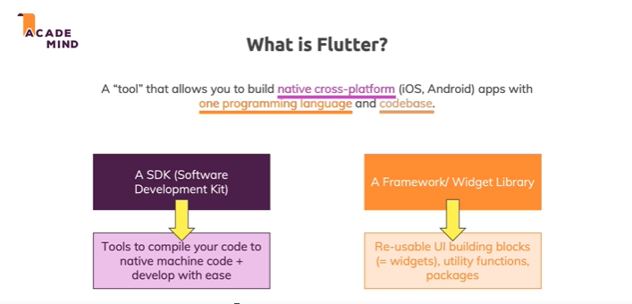
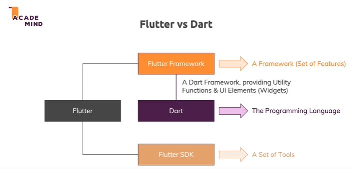

# what is flutter?
it is a tool to build native cross platforms (mobile apps, andriod and ios) with one program language. write once then produce multi extensions for each os 

flutter dependes on SDK: software development toolkit.

flutter use dart as a frontend program language, which is not limited to mobile apps we can use it also to create web apps

