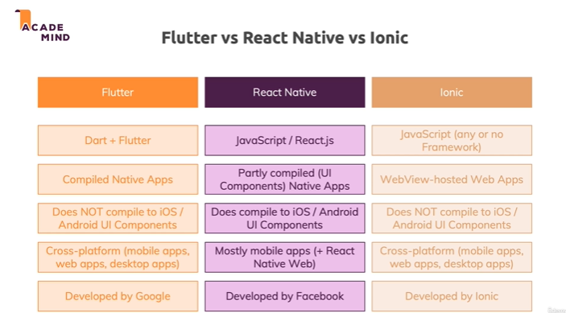

# flutter vs react native vs ionic
- [link](https://www.nomtek.com/blog/flutter-vs-react-native)

## The Biggest Difference between React Native and Flutter
- Flutter renders all components on its own canvas.

- React Native transforms JavaScript components into native ones. Because of that, component updates (to, for example, iOS 16) don’t have any impact on Flutter apps but do on React Native apps.

- Depending on where you’re standing, this can be a good or bad thing. For example, if you want your components to stay exactly the way you want them to, Flutter’s approach will satisfy you. But if you want your app to “catch up” with the latest native component designs, then React Native isthe way to go — in React Native this update happens automatically and is free. Also, if you don't want your components in a React Native app to follow the new iOS design (because you want to retain the style, for example), you can turn the automatic component update off.

- But to include the latest native components in Flutter, you have to update the app manually.