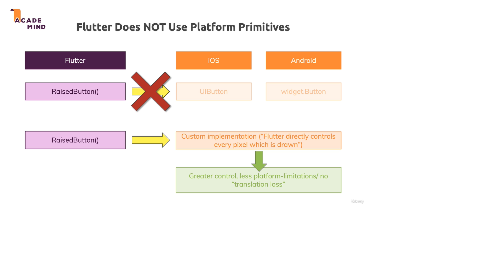

# flutter architecture
1. flutter build a widget tree (UI as code). which is like component in react.js or a dom tree in html
2. produce platform differences.
3. one code only.

## dose flutter use platform primitives

Dart is not cross-compiled or mapped to any native widgets etc. Instead Flutter controls 100% of the pixels on the screen.