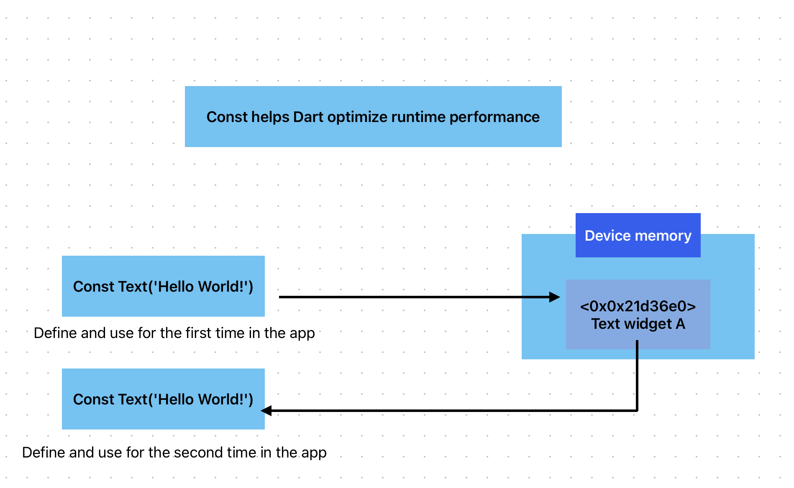

# Dart Basics

[image](./assets/files/dart-overview.pdf)

## what dart do when you click on run?

1. typically it is analyzing the code inside the `main.dart` file from top to bottom.
2. then the code compiled by dart and flutter tools. so basically it translated the code into IOS and android machine code.
3. finally the code packaged up and bundled together into the executed code that run in the simulator/device.

## notes

- `runApp()` function is a flutter build function. it is the main function should be called so the flutter app will be running.
- in dart to call a function you should call it in an upper function body. so this is the meaning of the `void main` function.
- what is the purpose of using `const` in front of the widget name? it is help to make the code is efficient. it is a feature to help dart to optimize runtime performance. (means that rather than define the widget again if we add the `const` keyword that means use the same widget that defined in the memory again without store it again in the memory) so it will reduce the memory size. by store it once and calls it multiple time.

